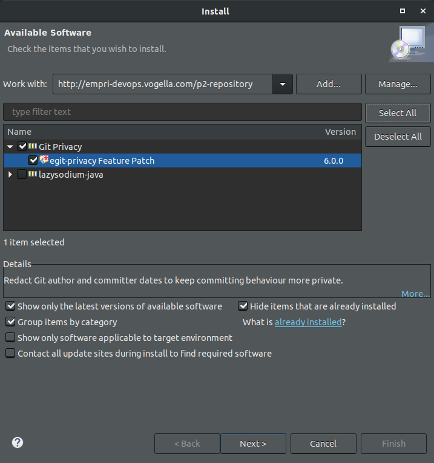
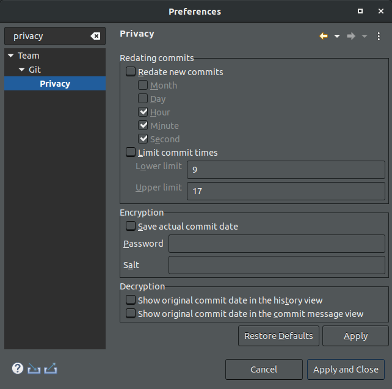

= EGit git-privacy plugin image:https://img.shields.io/badge/License-EPL%202.0-blue.svg["EPL 2.0", link="https://www.eclipse.org/legal/epl-2.0/"]

== What's the purpose of this plug-in?

The goal of this plug-in is to give Eclipse users the ability to reduce the amount of personal information that they are leaking when interacting the Git version control system.
There exists another version of this functionality implemented in Python, using a commit-hook based approach.
You can find this implementation here: https://github.com/EMPRI-DEVOPS/git-privacy/
The goal of this Eclipse plug-in is to stay compatible with the encryption format of the Python version, so you can switch between both versions.

== Functionalities provided by this plug-in

The Eclipse Plug-in offers the following features:

* Ability to redate new commits based on a fixed pattern
* Ability to redate new commits based on a acceptable time window
* Ability to save the original commit date in encrypted form
* A preference page that allows you to configure and turn those features on and off

== Installing the Eclipse Plugin

// The Plugin is available at the Eclipse Marketplace: https://marketplace.eclipse.org/content/...

The plug-in can be installed through the p2 update site at: http://empri-devops.vogella.com/p2-repository

This p2 update site can be entered in the following dialog by clicking menu:Help[Install New Software...].

== Usage

Open the preference page to activate the privacy features that you want to use.

== Compatibility

Since the plug-in is implemented as a feature patch, it is only compatible with the 2020-06 release of egit. (v5.8.0.202006091008-r)

== License

Free use of this software is granted under the terms of the EPL version 2 (EPL2.0).
